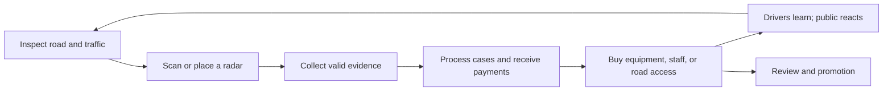

# Vision, player promise, and scope

## The pitch

**Radar Republic** is a small, replayable 3D game about turning roadside speeding fines into an increasingly ridiculous national recovery plan. You start as a field officer and logistics clerk in the fictional Republic of Valdorne, between the bureaucratic provinces of Francelle and the wealthy cantons of Helvère. The administration insists that a patrol car can solve a fiscal crisis. The absurdity belongs to the premise, not to a claim about real public finance.

The player fantasy is practical ingenuity: find a good spot, read traffic, make a satisfying capture, fund a better tool, and later recognize that the tiny roadside station has become an institution. The satire grows with the scale: a squeaky speed gun eventually reports to a Ministry of Extraordinary Ordinary Revenue.

## Four design pillars

| Pillar | What the player does | Evidence that it works |
|---|---|---|
| Understandable physical skill | Aim, track, identify, occasionally pursue | Player can explain a missed capture |
| Spatial optimization | Trade concealment against a clear measurement corridor | Two nearby placements have explainable differences |
| Growth with bottlenecks | Turn evidence into collected cash through staff and equipment | Purchases change decisions, not just a number |
| Funny, consequential administration | Balance revenue, public anger, and approval | A promotion feels exciting and faintly alarming |

Revenue is the primary objective. Public opinion is a visible constraint that creates difficult choices, not a hidden morality test. The game can reward an efficient, less unpopular operation without abandoning the user's money-making premise.

## Modes and length

- **First slice:** 20–30 minutes, two or three short field shifts then the first fixed camera and a short network demonstration.
- **Campaign:** provisional 2–4 hours for the first complete national recovery, spread over 24 shifts. Optional investigations and careful planning extend it. Finishing the campaign is not required to try a challenge.
- **Friend challenge:** 6 active shifts × 5 simulation minutes, a fixed starting kit, and a seeded scenario. Planning pauses add real time; label it “30 minutes of operations,” not a 30-minute wall-clock guarantee.
- **Sandbox, later:** relaxed money pressure and custom rules; separate results from challenges.

No idle/offline earnings. No live multiplayer in the first release. Asynchronous comparison gives friends a reason to replay without building synchronization, matchmaking, or a permanent server.

## The layered loop

Every layer reuses the previous one. Fixed cameras never remove manual scanning: field work finds new sites and handles exceptional speeders while ordinary processing runs in the background. When the office is overloaded, surveying, moving to higher-quality evidence, or buying capacity is more useful than blindly making more cases. Pursuits are optional high-skill opportunities rather than mandatory chores for every ticket.

## Scope ladder

| Delivery | Included | Explicitly deferred |
|---|---|---|
| P0: prove the loop | Greybox 3D roadside, moving cars, manual radar, money feedback | Driving, staff, story |
| P1: vertical slice | Small drivable district, upgrade, first fixed camera, exposure/readability, awareness, basic queue, local result | Section radar, borders, political branching |
| P2: friends alpha | Two road tiers, repeatable challenge, saves, car improvements, one pursuit, clerk, export/import scores | Hosted score verification |
| P3: full small game | Three districts, section/mobile radars, border administration, rank reviews, political events, endings | Procedural country, real-world map, traffic-light network |

First release target content: three reusable district kits, six traffic silhouettes, three player cars, five radar roles including upgrades, four staff roles, six promotions, twelve short events, and about twelve Easter eggs. Reduce content before expanding the schedule.

## What makes it different

The same 3D scene is both a workplace and a puzzle. A hedge, road bend, van, or building can make an installation less noticeable while ruining its plate view. The player learns to distinguish “hidden” from “effective.” The office then forces another choice: more photos do not help if no one can process them. Habit and public attention make a once-perfect site change over time.

## Uncertainties to resolve by playing

1. Does holding a lock on a car feel satisfying after ten captures? If not, fix feedback and target selection before adding content.
2. Can players predict the effect of moving a camera without watching a tutorial? If not, simplify the preview before increasing simulation detail.
3. Does automation free attention for better decisions or create an accounting screen? Keep exceptions and placement in the foreground.
4. Do pursuits add variety without turning development into a driving simulator? If not, ship them as bounded interception events.
5. Can a novice reach the first fixed camera without grinding? Use the scripted tutorial grant if the price curve alone fails.

These are decisions for playtests, not promises that the planning spreadsheet can prove.
